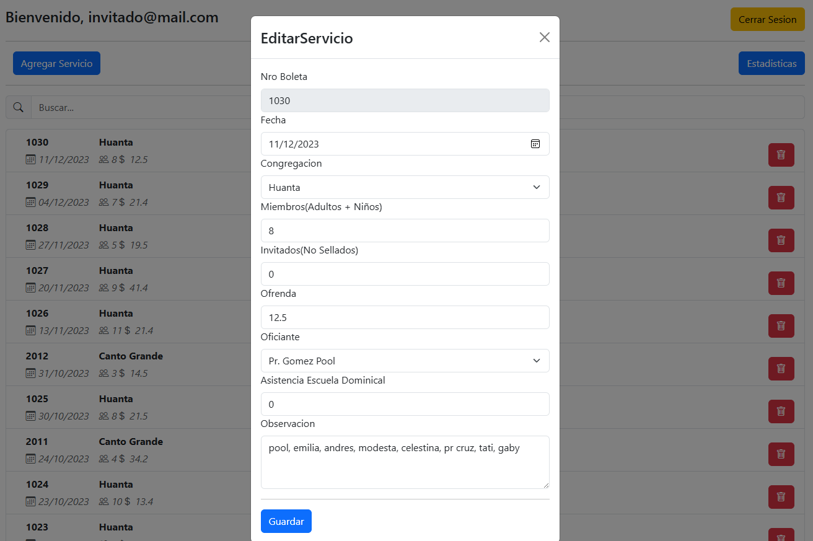
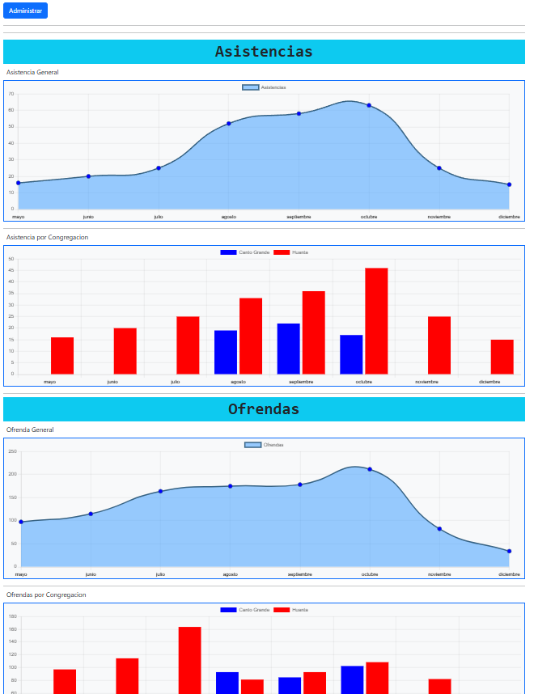
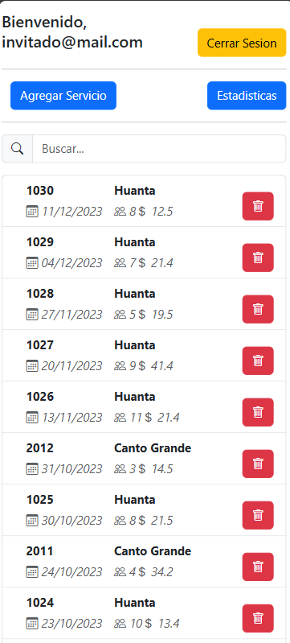
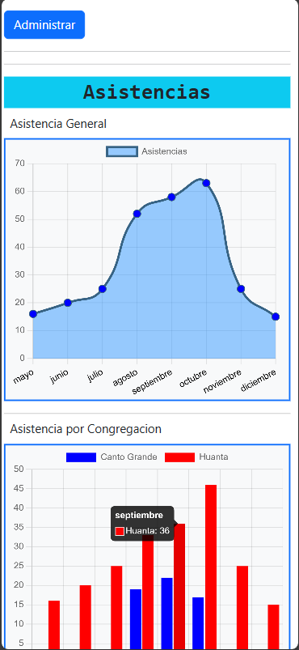

# INA Estadísticas

Primer proyecto diseñado para la recolección  de datos de la ina en los servicios y visualizacion de estadisticas de asistencias y ofrendas por mes.

se puede previsualizar en [https://inawebestadisticas.web.app/](https://inawebestadisticas.web.app/)

## Tecnologías
<table align="center">
  <tr>
    <td align="center">
       
      JavaScript
    </td>
    <td align="center">
       
      React
    </td>
    <td align="center">
       
      Firebase
    </td>
    
  </tr>
</table>

## Desktop

## Mobile

